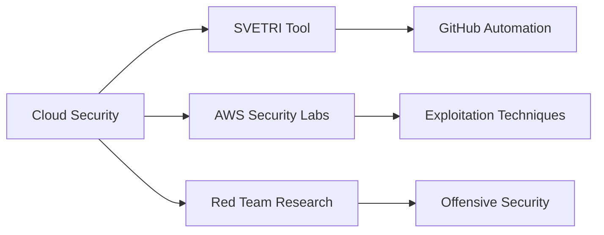

<div align="center">

# 👋 Hi, I'm Naveen Soni

### Cloud Security Engineer | DevOps Enthusiast | Open Source Builder


[](https://github.com/nsoni44)
[](https://github.com/nsoni44?tab=followers)
[](https://github.com/nsoni44?tab=repositories)

</div>

---

## 🚀 About Me

```python
class SecurityEngineer:
    def __init__(self):
        self.name = "Naveen Soni"
        self.role = "Cloud Security Engineer"
        self.location = "🌍 Earth"
        self.interests = ["AWS Security", "DevOps", "Red Team", "Open Source"]
        self.current_focus = "Building SVETRI - GitHub Security Intelligence Tool"
    
    def say_hi(self):
        print("Thanks for dropping by! Let's build secure systems together 🔐")

me = SecurityEngineer()
me.say_hi()
```

- 🔐 Passionate about **Cloud Security** and **Offensive Security**
- 🛠️ Creator of [**SVETRI**](https://github.com/nsoni44/github-security-audit) - GitHub Security Audit Tool
- ☁️ Building **AWS Security Labs** for learning exploitation techniques
- 🎯 Breaking things to understand how to protect them better
- 💡 Open Source contributor making security accessible to everyone

---

## 🔥 Featured Projects

<div align="center">

<table>
<tr>
<td width="50%">

<h3 align="center">🔒 SVETRI</h3>

<div align="center">  
<a href="https://github.com/nsoni44/github-security-audit">

</a>

**GitHub Security Intelligence Tool**

Comprehensive security audit system for GitHub repositories

`Bash` `GitHub CLI` `Security` `DevOps`

⭐ Star | 🍴 Fork | 📖 [Wiki](https://github.com/nsoni44/github-security-audit/wiki)

</div>

</td>
<td width="50%">

<h3 align="center">🔍 Lambda Audit Tool</h3>

<div align="center">
<a href="https://github.com/nsoni44/lambda-audit-automation">

</a>

**AWS Lambda Security Auditor**

Automated security auditing for AWS Lambda functions

`Python` `AWS` `Security` `Automation`

⭐ 4 Stars

</div>

</td>
</tr>

<tr>
<td width="50%">

<h3 align="center">☁️ AWS Vulnerability Scanner</h3>

<div align="center">
<a href="https://github.com/nsoni44/aws-vulnerability-scanner-demo">

</a>

**Cloud Risk Assessment Tool**

Vulnerability scanner with AI remediation strategies

`Python` `AWS` `Risk Scoring` `AI`

</div>

</td>
<td width="50%">

<h3 align="center">🔓 AWS Security Labs</h3>

<div align="center">

**Hands-on Security Research**

Collection of AWS exploitation labs:
- 💣 S3 Ransomware Red Team
- 🔐 Lambda Command Injection
- 🤖 Bedrock Privilege Escalation
- 📂 LFI Lab

`Python` `AWS` `Red Team` `Pentesting`

</div>

</td>
</tr>
</table>

</div>

---

## 💻 Tech Stack & Tools

<div align="center">

### Languages


### Cloud & DevOps


### Security Tools


### Databases & Tools


</div>

---

## 📊 GitHub Statistics

<div align="center">


</div>

---

## 📈 Contribution Activity

<div align="center">


</div>

---

## 💡 Current Focus

<div align="center">



</div>

🔭 **Working on:** SVETRI - GitHub Security Intelligence Tool  
🌱 **Learning:** Advanced AWS Security, Kubernetes Security, Red Team Tactics  
💬 **Ask me about:** AWS Security, DevOps Automation, Security Tools, Python  
⚡ **Fun fact:** I break things professionally to make them more secure!

---

## 📫 Connect With Me

<div align="center">

[](https://www.linkedin.com/in/naveen-s-52044a55/)
[](mailto:nsoni44@gmail.com)
[](https://github.com/nsoni44)

</div>

---

<div align="center">

### 💭 Random Security Quote


### ⚡ Latest Activity

<!--START_SECTION:activity-->
1. ❌ Closed PR [#15](https://github.com/nsoni44/aws-vulnerability-scanner-demo/pull/15) in [nsoni44/aws-vulnerability-scanner-demo](https://github.com/nsoni44/aws-vulnerability-scanner-demo)
2. 🗣 Commented on [#15](https://github.com/nsoni44/aws-vulnerability-scanner-demo/pull/15#issuecomment-4409601520) in [nsoni44/aws-vulnerability-scanner-demo](https://github.com/nsoni44/aws-vulnerability-scanner-demo)
3. ℹ️ Reopened PR [#21](https://github.com/nsoni44/aws-vulnerability-scanner-demo/pull/21) in [nsoni44/aws-vulnerability-scanner-demo](https://github.com/nsoni44/aws-vulnerability-scanner-demo)
4. ❌ Closed PR [#21](https://github.com/nsoni44/aws-vulnerability-scanner-demo/pull/21) in [nsoni44/aws-vulnerability-scanner-demo](https://github.com/nsoni44/aws-vulnerability-scanner-demo)
5. 🗣 Commented on [#21](https://github.com/nsoni44/aws-vulnerability-scanner-demo/pull/21#issuecomment-4409591333) in [nsoni44/aws-vulnerability-scanner-demo](https://github.com/nsoni44/aws-vulnerability-scanner-demo)
<!--END_SECTION:activity-->

---


**💻 "Security is not a product, but a process"** - Bruce Schneier

⭐️ From [nsoni44](https://github.com/nsoni44) with 🔐

</div>
